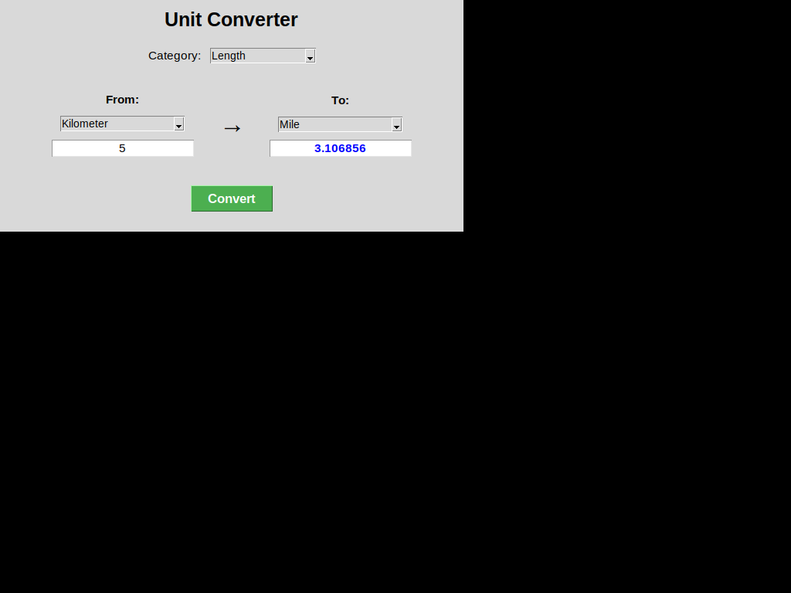

# Unit Converter GUI Application

A Python GUI application built with Tkinter for converting between different units across multiple categories.



## Features

- **5 Unit Categories:**
  - Length (Meter, Kilometer, Mile, Foot, Inch, etc.)
  - Volume (Liter, Gallon, Milliliter, etc.)
  - Weight (Kilogram, Pound, Gram, Ounce, etc.)
  - Temperature (Celsius, Fahrenheit, Kelvin)
  - Time (Second, Minute, Hour, Day, Week, etc.)

- **Dynamic Unit Selection:** Unit dropdowns automatically update when you change the category
- **Accurate Conversions:** Handles both linear conversions and special cases like temperature
- **Decimal Support:** Accepts both integers and decimal numbers
- **User-Friendly Interface:** Clean, intuitive GUI with clear input and output areas

## Requirements

- Python 3.x
- Tkinter (usually comes pre-installed with Python)

On Ubuntu/Debian systems, if Tkinter is not installed:
```bash
sudo apt-get install python3-tk
```

## Usage

1. Run the application:
```bash
python3 unit_converter.py
```

2. Select a category from the top dropdown (Length, Volume, Weight, Temperature, or Time)

3. Choose the "From" unit on the left side

4. Choose the "To" unit on the right side

5. Enter a numeric value in the input field

6. Click the "Convert" button to see the result

## Examples

- **Length:** 5 kilometers → 3.106856 miles
- **Temperature:** 100 Celsius → 212 Fahrenheit
- **Weight:** 1 kilogram → 2.204624 pounds
- **Volume:** 1 gallon (US) → 3.78541 liters
- **Time:** 1 hour → 3600 seconds

## Code Structure

The application is organized using object-oriented programming:

- `UnitConverter` class: Main application class containing all GUI components and logic
- `create_widgets()`: Sets up all GUI elements
- `on_category_change()`: Handles category dropdown changes
- `update_unit_dropdowns()`: Updates unit options based on selected category
- `convert_temperature()`: Special handler for temperature conversions
- `convert()`: Main conversion logic for all unit types

## License

This project is open source and available for educational purposes.
